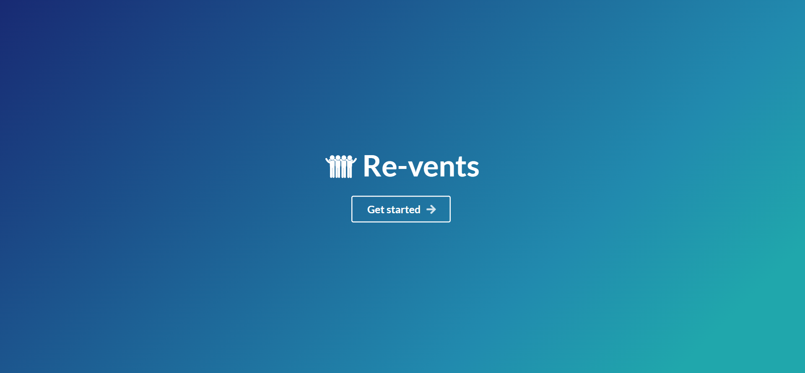

# Revents.

#### Immerse yourself in a captivating virtual journey of events.

<br />

### ⚒ Project Demo:

Experience the project in action by visiting our live demo: [Revents Website](https://revents-events.vercel.app)

---

### 🕵️‍♂️ Project Details:

Revents is a dynamic events website built using React and Firebase. Discover and attend a diverse range of exciting events in your area. With personalized recommendations, seamless registration, and interactive event pages, Revents makes event exploration effortless. Connect with other attendees, track events, and make informed choices with user reviews.

---

### ⚙ Dockerized Execution:

To run project using Docker run the following commands:

For Development:

```bash
  docker build -f Dockerfile.dev -t <tag-name> .

  docker run -p 3000:3000 <tag-name>
```

For Production:

```bash
  docker build -f Dockerfile.prod -t <tag-name> .

  docker run -p 80:3000 <tag-name>
```

---

### 🤹‍♂️ Skills Utilized:

&nbsp;&nbsp;&nbsp;&nbsp;
&nbsp;&nbsp;&nbsp;&nbsp;
&nbsp;&nbsp;&nbsp;&nbsp;
&nbsp;&nbsp;&nbsp;&nbsp;
&nbsp;&nbsp;&nbsp;&nbsp;
&nbsp;&nbsp;&nbsp;&nbsp;

---

### ✔ Contributors:

We would like to acknowledge the following contributor for their valuable contributions to this project:

<p align="center">
  <a href="https://github.com/faraasat">
    
  </a>&nbsp&nbsp&nbsp&nbsp&nbsp&nbsp&nbsp&nbsp&nbsp&nbsp&nbsp&nbsp
</p>

---

### 📷 Project UI:

Take a glimpse into the Project:

<p align="center">
  <a href="http://revents-events.vercel.app/">
    
  </a>
</p>
